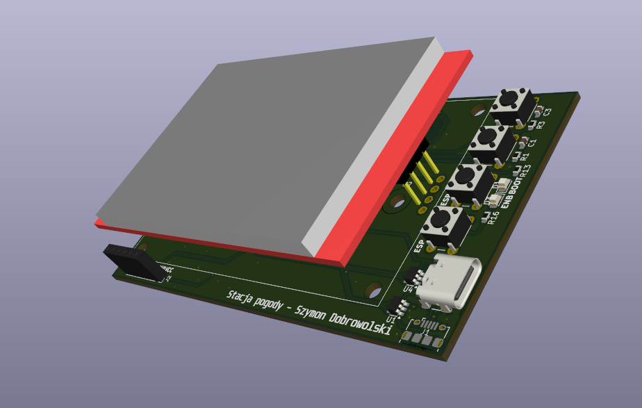
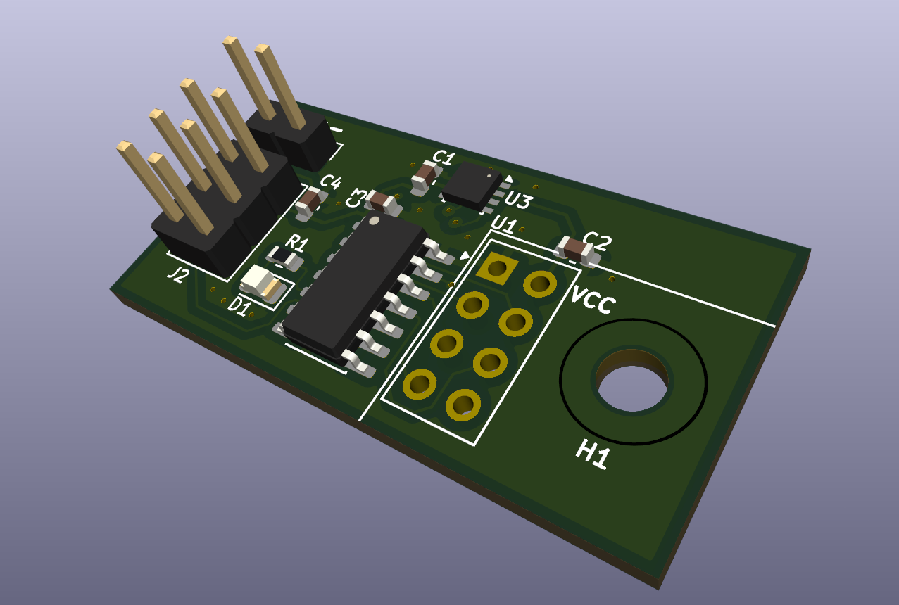
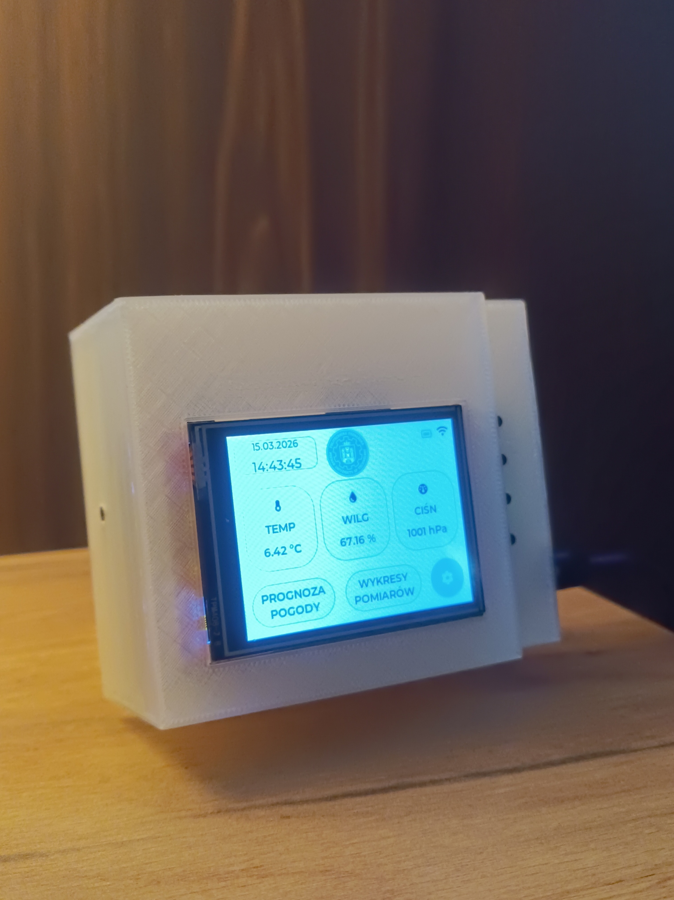
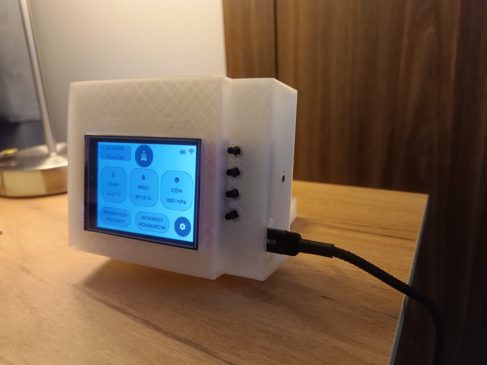

# 🌤️ RF Meteo Station - Custom ESP32 Weather System


A complete, end-to-end open-source weather station project. This system combines custom hardware design, 3D-printed enclosures, and an advanced multithreaded firmware architecture to deliver a modern, touch-enabled weather dashboard.

---

## 1. ⚡ PCB Design (Custom Hardware)
The hardware architecture is divided into two separate custom-designed printed circuit boards:

* **Main Indoor Unit:** Houses the ESP32 microcontroller, power management, display connector (SPI), and the nRF24L01 radio receiver.
* **External Sensor Node:** A low-power, battery-operated board featuring environmental sensors and an nRF24L01 transmitter to send data wirelessly to the main unit.

| Main Board | External Sensor Board |
|:---:|:---:|
|  |  |

**📄 Full Schematics (PDF):**
* [Open Main Board Schematic PDF](images/int_scheme.pdf)
* [Open Sensor Board Schematic PDF](images/ext_scheme.pdf)

---

## 2. 🧊 Enclosure Design (3D Models)
To make the project a fully finished product, custom enclosures were modeled from scratch and 3D printed.

* **Main Display Case:** Designed to perfectly fit the touch screen, custom PCB, and provide easy access to power ports.
* **Outdoor Sensor Shield:** Features a Stevenson screen-inspired design to protect the external PCB from rain and direct sunlight while allowing accurate temperature and humidity readings.

| Display Enclosure | Sensor Enclosure |
|:---:|:---:|
|  |  |

---

## 3. 💻 Code Architecture & Features
The firmware is built on top of the **ESP-IDF** framework and utilizes **FreeRTOS** to handle multiple background tasks without blocking the UI. 

### Key Software Features:
* **Advanced GUI (LVGL):** A fluid, touch-optimized interface featuring a dashboard, 24h interactive charts, and a 7-day forecast. The UI logic is completely decoupled from the system core.
* **Multithreading:** Dedicated FreeRTOS tasks for display rendering, wireless data receiving (nRF24L01), and Wi-Fi management.
* **Live Weather API:** Fetches and parses real-time forecast data via the Open-Meteo API using `cJSON`.
* **Smart Power Management:** Features a Day/Night mode with a PWM soft-start mechanism to prevent sudden power spikes and brownout resets.
* **NVS Storage:** Safely retains Wi-Fi credentials, location preferences, and brightness settings between reboots.
* **SNTP Time Sync:** Automatically maintains atom-accurate system time in the background.
* **Display Support:** Codebase is optimized for **ST7789** controllers with easy migration to **ILI9341** via the `esp_lcd` framework.

---

## 4. 🚀 How to Build & Flash
The software is designed for the Espressif ESP-IDF framework (v5.0 or newer).

**Step 1: Clone the repository**
```bash
git clone [https://github.com/SzymonDobrowolski/rf_meteo_station.git](https://github.com/SzymonDobrowolski/rf_meteo_station.git)
cd rf_meteo_station/ESP32_int_station_code/internal_module_code_ST7789
```

**Step 2: Install Display Dependencies (ILI9341 Only)**
*Note: The default codebase is optimized for the ST7789 controller. If your specific build uses the ILI9341 display, you must add the official driver component before building:*
```bash
idf.py add-dependency "espressif/esp_lcd_ili9341"
```

**Step 3: Build and Flash**
Connect your ESP32 board and run the following commands:
```bash
idf.py set-target esp32
idf.py build
idf.py -p (YOUR_PORT) flash monitor
```

---

## 5. 🌟 Final Result
Here is the fully assembled, programmed, and working RF Meteo Station in action!

<p align="center">
  
  &nbsp;
  
</p>
